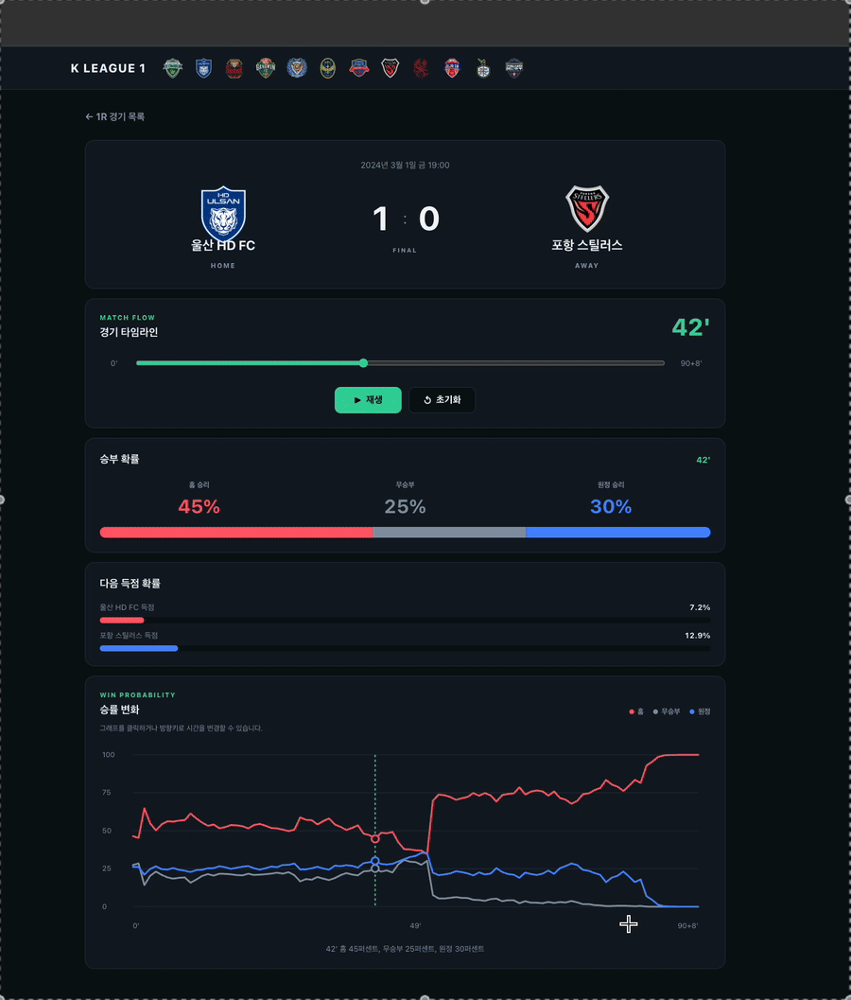
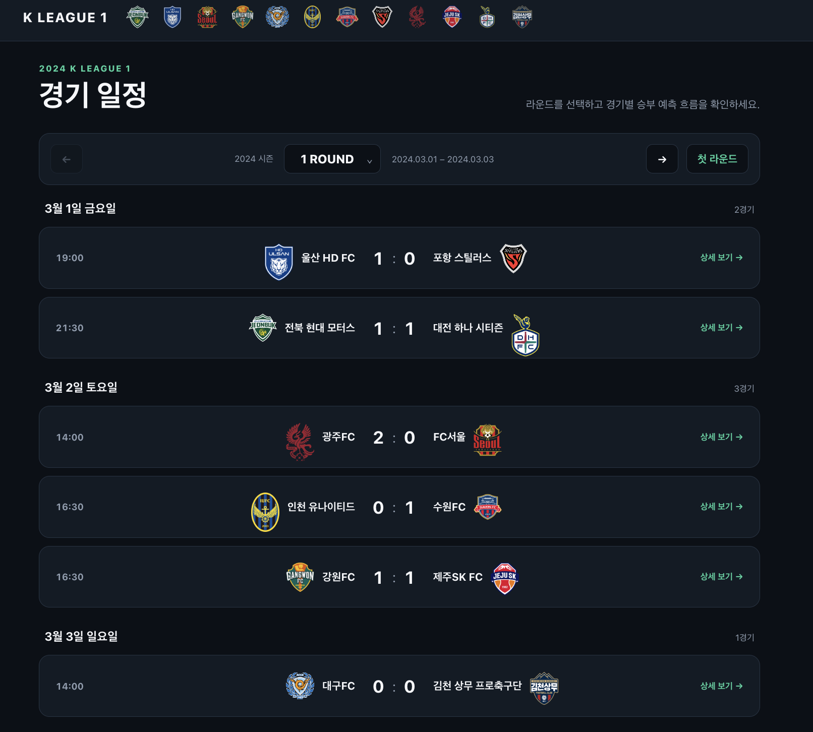
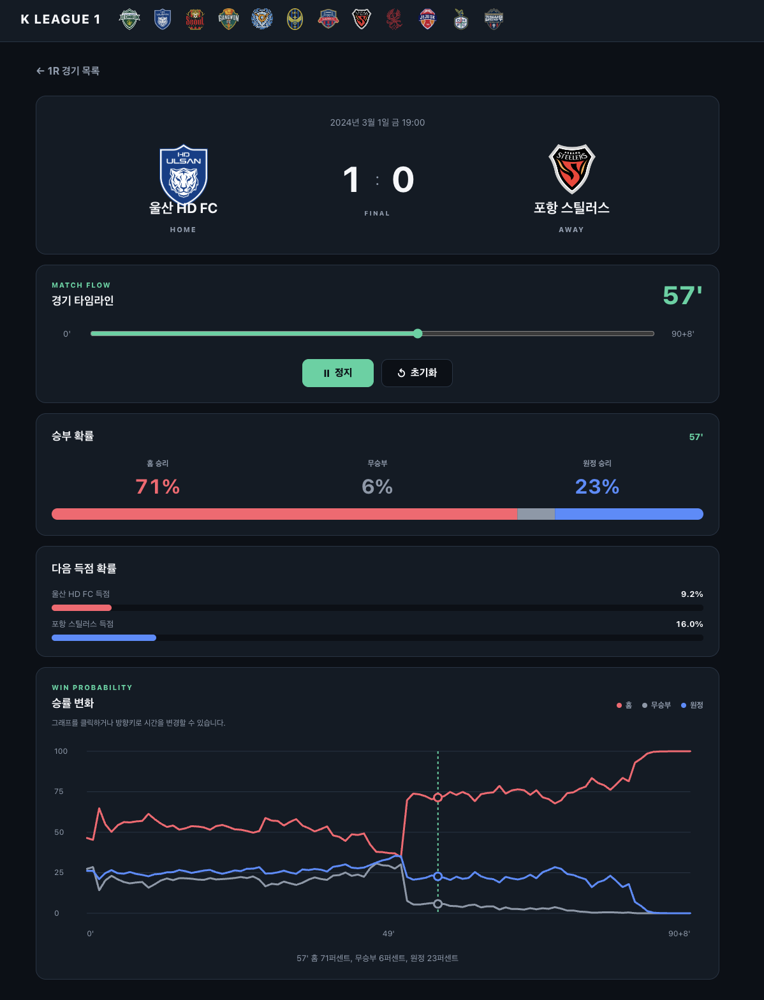

# K LEAGUE 1 경기 승부 예측

K리그 경기의 시간별 승률과 득점 확률을 탐색하는 React 기반 스포츠 데이터 대시보드입니다.

사용자는 라운드별 경기 목록에서 원하는 경기를 선택하고, 경기 시작부터 실제 종료 시간까지 이동하며 홈 승리·무승부·원정 승률의 변화를 확인할 수 있습니다.

## 데모

### 타임라인과 승률 변화

경기 시간을 재생하거나 직접 이동하면 현재 확률과 승률 그래프의 선택 지점이 함께 변경됩니다.

<p align="center">
  
</p>

### 라운드별 경기 목록

라운드를 선택하고 날짜별로 정리된 경기 결과를 확인할 수 있습니다.



### 경기 상세

팀과 최종 점수, 현재 승률, 득점 확률, 실제 종료 시간까지의 승률 변화를 한 화면에서 제공합니다.

<p align="center">
  
</p>

## 핵심 사용자 흐름

1. 시즌 라운드를 선택합니다.
2. 날짜별 경기 목록에서 경기를 선택합니다.
3. 경기 상세 화면에서 팀, 최종 점수, 현재 승률을 확인합니다.
4. 슬라이더 또는 재생 버튼으로 경기 시간을 이동합니다.
5. 승률 변화 그래프에서 경기 흐름이 크게 바뀐 시점을 탐색합니다.

## 주요 기능

- 라운드 목록 및 이전·다음 라운드 이동
- 날짜별 경기 카드와 상세 화면 이동
- 홈 승리·무승부·원정 승률 표시
- 홈·원정 득점 확률 표시
- 실제 경기 종료 시간을 사용하는 타임라인
- 90분 초과 시간을 `90+N'` 형식으로 표시
- 타임라인 재생·정지·초기화 및 직접 이동
- 홈·무승부·원정 승률 변화 그래프
- 그래프 클릭과 키보드 조작을 통한 시간 변경
- 상세 URL 직접 접근 및 새로고침 복구
- 로딩·오류·빈 데이터 상태 구분
- 모바일 반응형 레이아웃과 키보드 접근성

## 주요 구현 및 리팩토링

### 일관된 화면 기반

- Vite 기본 스타일을 제거하고 스포츠 데이터 대시보드에 맞는 전역 스타일을 구성했습니다.
- 색상, 간격, 카드 반경, 콘텐츠 너비를 CSS 디자인 토큰으로 관리합니다.
- 모든 페이지가 공통 `AppLayout`과 최대 1120px 콘텐츠 영역을 사용합니다.
- 홈·무승부·원정 색상을 막대, 그래프, 수치에 동일하게 적용했습니다.

### 시계열 사용자 경험

- 기존 90분 고정 슬라이더를 경기 데이터의 실제 최대 시간 기반으로 변경했습니다.
- 승률과 득점 확률 중 가장 큰 `minute`을 경기 종료 시간으로 사용합니다.
- 재생 종료 시 버튼 상태가 자동으로 정지 상태와 일치하도록 구성했습니다.
- 별도 차트 라이브러리 없이 SVG로 승률 변화 그래프를 구현했습니다.
- 그래프와 슬라이더가 하나의 `minute` 상태를 공유하도록 설계했습니다.

### API 및 상태 관리

- 공통 Axios 인스턴스와 `VITE_API_BASE_URL` 환경변수를 사용합니다.
- 경기 정보·승률·득점 확률 API를 `useMatchDetail`에서 병렬 호출합니다.
- 화면 이탈 시 진행 중인 요청을 취소해 불필요한 상태 갱신을 방지합니다.
- API 응답 필드와 확률 단위를 Adapter에서 정규화합니다.
- 페이지 컴포넌트는 백엔드 필드 변형을 알지 않고 화면 상태와 사용자 입력에 집중합니다.
- `location.state`는 초기 표시에만 사용하고 상세 API 응답을 최종 데이터로 사용합니다.

### 예외와 접근성

- 로딩, API 오류, 데이터 없음 상태를 서로 다른 UI로 표시합니다.
- 로고를 불러오지 못하면 팀명 첫 글자를 대체 이미지로 표시합니다.
- 버튼, 슬라이더, 그래프를 키보드로 조작할 수 있습니다.
- 색상과 텍스트 라벨을 함께 사용해 확률 유형을 구분합니다.
- `prefers-reduced-motion` 환경에서는 불필요한 애니메이션을 줄입니다.

## 화면 구조

```text
라운드 목록
└── 라운드 선택
    └── 날짜별 경기 카드
        └── 경기 상세
            ├── 팀·최종 점수
            ├── 경기 타임라인
            ├── 현재 승률·득점 확률
            └── 승률 변화 그래프
```

## 데이터 흐름

```text
MatchDetailPage
    └── useMatchDetail(matchId)
        ├── GET /matches/:matchId
        ├── GET /matches/:matchId/goal-probabilities
        └── GET /matches/:matchId/win-probabilities
             ↓
        Adapter 정규화
             ↓
        loading / error / empty / success
             ↓
        TimelineController · ProbabilityChart · MatchSummary
```

## 기술 스택

| 구분 | 기술 |
| --- | --- |
| UI | React 19 |
| 빌드 | Vite 7 |
| 라우팅 | React Router 7 |
| HTTP | Axios |
| 스타일 | CSS Modules, CSS Custom Properties |
| 품질 검사 | ESLint |

## 디렉터리 구조

```text
src/
├── api/                    # Axios 클라이언트와 API 함수
├── components/
│   ├── layout/             # 공통 레이아웃과 헤더
│   ├── match/              # 경기 상세 UI
│   ├── rounds/             # 라운드 및 경기 카드 UI
│   └── ui/                 # 로딩·오류·빈 상태
├── features/matches/
│   ├── hooks/              # 상세 데이터 상태 로직
│   └── utils/              # API Adapter와 시간 포맷
├── pages/                  # 라운드 및 경기 상세 페이지
└── styles/                 # 디자인 토큰과 전역 스타일
```

## 실행 방법

### 1. 환경변수 설정

```bash
cp .env.example .env
```

기본 설정은 다음과 같습니다.

```dotenv
VITE_API_BASE_URL=http://localhost:8080
```

### 2. 의존성 설치 및 실행

```bash
npm install
npm run dev
```

프론트엔드는 기본적으로 `http://localhost:5173`, 백엔드는 `http://localhost:8080`을 사용합니다.

## 검사 명령

```bash
npm run lint
npm run build
```

현재 두 명령 모두 통과합니다.

## 사용 API

- `GET /rounds`
- `GET /rounds/:roundId/matches`
- `GET /matches/:matchId`
- `GET /matches/:matchId/goal-probabilities`
- `GET /matches/:matchId/win-probabilities`

실제 응답 예시는 [docs/api-response-examples.md](docs/api-response-examples.md)에서 확인할 수 있습니다.

## 데이터 처리 정책

- 승률은 Adapter에서 0~100 단위로 통일합니다.
- 득점 확률은 0~1 단위로 통일합니다.
- 경기 최대 시간은 두 확률 타임라인의 가장 큰 `minute`으로 계산합니다.
- 희소 데이터는 임의로 보간하지 않습니다.
- 특정 분의 데이터가 없으면 존재하는 확률만 표시하고 나머지는 숨깁니다.

## 알려진 백엔드 후속 사항

- 존재하지 않는 경기 ID 요청이 HTTP 404가 아닌 500을 반환합니다.
- 프론트엔드는 해당 응답을 일반 조회 오류 상태로 처리합니다.

## 작업 기록

리팩토링 단계와 검증 결과는 [docs/refactoring-baseline.md](docs/refactoring-baseline.md)에 기록했습니다.
